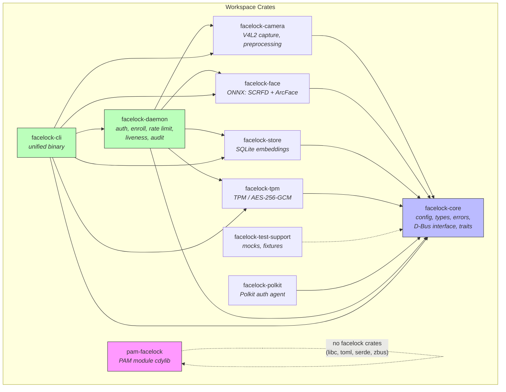
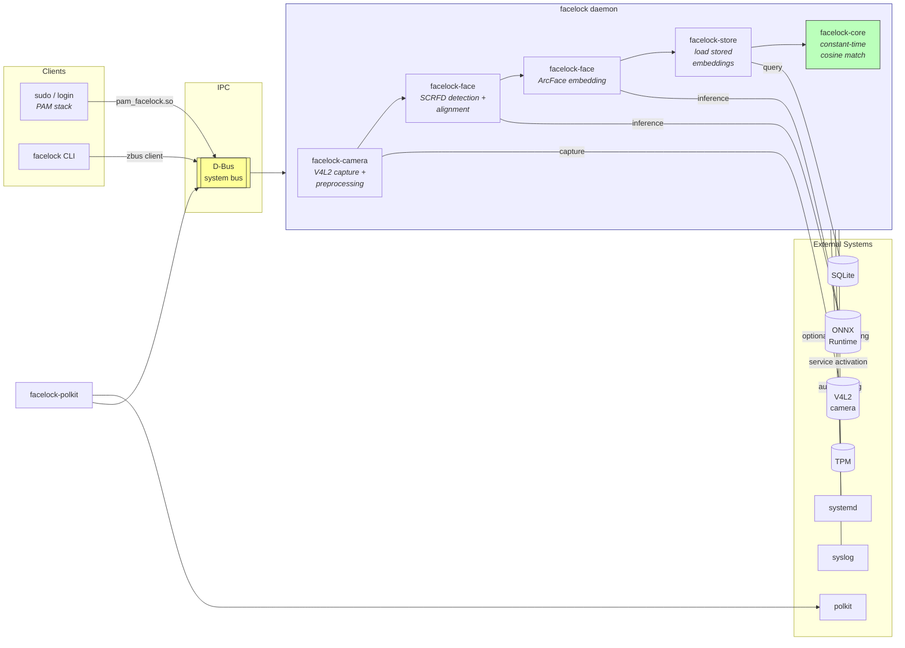

# Architecture

## Overview

Facelock is a face authentication system for Linux PAM. It detects faces via SCRFD, extracts embeddings via ArcFace, and matches against stored models using cosine similarity. All processing is local -- no network calls, no cloud services, no telemetry.

## System Diagram

```
┌──────────────────┐     ┌──────────────────────────────────────┐
│  sudo / login    │     │  facelock CLI                          │
│  (PAM stack)     │     │  (enroll, test, list, preview, ...)  │
└────────┬─────────┘     └───────────────┬──────────────────────┘
         │                               │
         │                               │ direct mode (fallback)
         │                               │ or IPC to daemon
    ┌────▼────────────┐                  │
    │  pam_facelock.so  │──────────────────┤
    │  (~2MB cdylib) │                  │
    │                 │                  │
    │  daemon mode:   │                  │
    │  → D-Bus IPC    │          ┌───────▼──────────────┐
    │                 │          │  facelock daemon        │
    │  oneshot mode:  │          │  (persistent process) │
    │  → facelock auth  │          │                       │
    └─────────────────┘          │  ┌─────────────────┐  │
                                 │  │ V4L2 Camera     │  │
                                 │  │ (auto-detected) │  │
                                 │  └────────┬────────┘  │
                                 │           │           │
                                 │  ┌────────▼────────┐  │
                                 │  │ SCRFD Detection  │  │
                                 │  │ → Alignment     │  │
                                 │  │ → ArcFace Embed │  │
                                 │  └────────┬────────┘  │
                                 │           │           │
                                 │  ┌────────▼────────┐  │
                                 │  │ SQLite Store    │  │
                                 │  │ (embeddings)    │  │
                                 │  └─────────────────┘  │
                                 └───────────────────────┘
```

## Crate Dependencies

```
facelock-core (config, types, IPC, traits)
    ├── facelock-camera (V4L2, auto-detect, preprocessing)
    ├── facelock-face (ONNX: SCRFD + ArcFace)
    ├── facelock-store (SQLite)
    ├── facelock-tpm (optional TPM encryption)
    └── facelock-test-support (mocks, dev-only)

facelock-daemon (auth/enroll logic, liveness, audit, rate limiter, handler)
    └── depends on: core, camera, face, store, tpm

facelock-cli (unified binary)
    └── depends on: core, camera, face, store, daemon, tpm

facelock-polkit (polkit agent)
    └── depends on: core

pam-facelock (PAM module)
    └── depends on: libc, toml, serde, zbus ONLY (no facelock crates)
```

## Mermaid Diagrams

The diagrams below render in GitHub, mdBook, and any Mermaid-capable viewer. They cover the same information as the ASCII diagrams above but add external integrations and the authentication data flow.

### Crate Dependency Graph



### System Data Flow and IPC



## Face Recognition Pipeline

### Detection (SCRFD)
- Input: grayscale frame after CLAHE enhancement
- Output: bounding boxes + 5-point landmarks (eyes, nose, mouth corners)
- Confidence threshold: `recognition.detection_confidence` (default 0.5)
- NMS threshold: `recognition.nms_threshold` (default 0.4)

### Alignment
- Affine transform from 5 landmarks to canonical positions
- Output: 112x112 aligned face crop
- Uses Umeyama similarity transform

### Embedding (ArcFace)
- Input: 112x112 RGB face crop
- Output: 512-dimensional L2-normalized float32 vector
- Cosine similarity = dot product (since L2-normalized)

### Matching
- Compare live embedding against all stored embeddings for the user
- Accept if best similarity >= `recognition.threshold` (default 0.80)
- Frame variance check: multiple frames must show different embeddings (anti-photo)

## Auth Flow

```
1. Pre-checks (disabled? SSH? lid closed? has models? rate limit? IR?)
2. Load user embeddings from store
3. Capture loop (until deadline):
   a. Capture frame
   b. Skip if dark
   c. Detect faces
   d. For each face: compute best_match against stored embeddings
   e. Track matched frames for variance check
   f. If variance passes (or disabled): return match
4. If timeout: return no_match
```

## Operating Modes

### Daemon Mode
The daemon (`facelock daemon`) runs persistently, holding ONNX models and camera resources in memory. The PAM module and CLI connect via D-Bus system bus. Benefits:
- ~200ms auth latency (models already loaded)
- Camera stays warm between requests
- Single point of resource management

### Oneshot Mode
The PAM module spawns `facelock auth --user X` for each auth attempt. The process loads models, opens camera, runs one auth cycle, and exits. Benefits:
- No background process
- No systemd dependency
- Works on any Linux system

### Direct CLI Mode
The CLI silently detects whether the daemon via D-Bus is available. If yes, uses IPC. If no, operates directly (opens camera, loads models inline). The user doesn't need to know which mode is active.

## Security Layers

1. **IR enforcement**: Only IR cameras allowed by default (prevents RGB photo attacks)
2. **Frame variance**: Multiple frames must show micro-movement (prevents static photo)
3. **Rate limiting**: 5 attempts per user per 60 seconds
4. **Model integrity**: SHA256 verification at every load
5. **D-Bus security**: System bus policy restricts daemon access
6. **Audit trail**: All auth events logged to syslog
7. **Process hardening**: systemd service runs with ProtectSystem=strict, NoNewPrivileges, etc.
